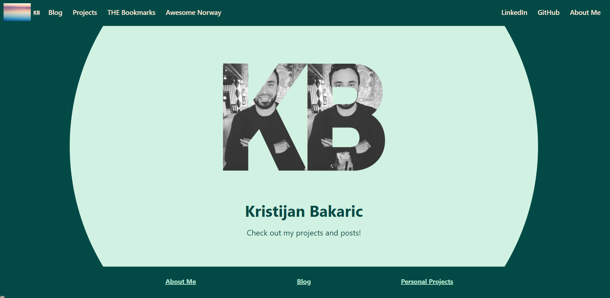

<br />
<p align="center">
  <a href="https://github.com/baky0905/personal-website">
  </a>

  <h3 align="center"><a href="https://baky0905.github.io/personal-website/"><strong> [Personal Website](https://baky0905.github.io/personal-website/)</strong></a> </h3>


    ·
    <a href="https://github.com/baky0905/personal-website/issues">Report Bug</a>
    ·
    <a href="https://github.com/baky0905/personal-website/issues">Request Feature</a>
  </p>
</p>


- [Getting Started](#getting-started)
  - [Prerequisites](#prerequisites)
  - [Installation](#installation)
- [Development and configuration](#development-and-configuration)
  - [Running the development server](#running-the-development-server)
  - [Build](#build)
  - [Project Structure](#project-structure)
- [Details of CI/CD automation setup](#details-of-cicd-automation-setup)
  - [Workflow](#workflow)
- [Roadmap](#roadmap)
- [Contributing](#contributing)
- [License](#license)
- [Contact](#contact)


### Built With

* [Docusaurus](https://docusaurus.io/) - An optimized site generator in React.
* [GitHub Actions](https://github.com/features/actions) - CI/CD automation
* [GitHub Pages](https://pages.github.com/) - Website Hosted directly from your GitHub repository. Just edit, push, and your changes are live.
* [Markdown](https://en.wikipedia.org/wiki/Markdown#:~:text=Markdown%20is%20a%20lightweight%20markup,using%20a%20plain%20text%20editor.) - book content.


## Getting Started

To get a local development environment follow these simple steps.
Keep in mind that I am developing on WSL2, Ubuntu-20.04.

### Prerequisites

* [nodejs](https://nodejs.org/en/)
* [git](https://git-scm.com/)

### Installation

1. Clone the repo
```sh
git clone https://github.com/baky0905/personal-website.git
```


2. Docusaurus is essentially a set of npm packages that can be installed over npm. Install npm dependencies. It will install all modules listed as dependencies in `package.json`
```sh
npm install
```

[More Information about docusaurus installation.](https://docusaurus.io/docs/installation)


## Development and configuration

### Running the development server

To preview your changes as you edit the files, you can run a local development server that will serve your website and it will reflect the latest changes.

```sh
npm run start
```

By default, a browser window will open at http://localhost:3000.

### Build

Docusaurus is a modern static website generator so we need to build the website into a directory of static contents and put it on a web server so that it can be viewed. To build the website:

```sh
npm run build
```

and contents will be generated within the /build directory, which can be copied to any static file hosting service like GitHub pages, Vercel or Netlify. Check out the docs on deployment for more details.


### Project Structure


```
./
├── docs
│   ├── doc1.md
│   ├── doc2.md
│   └── mdx.md
├── src
│   ├── css
│   │   └── custom.css
│   └── pages
│       ├── styles.module.css
│       └── index.js
├── static
│   ├── images
│   └── img
│    ...
├── docusaurus.config.js
├── package.json
├── README.md
└── sidebars.js
```

- `/docs/` - Contains the Markdown files for the docs. Customize the order of the docs sidebar in sidebars.js. More details can be found in the [docs guide](https://docusaurus.io/docs/docs-markdown-features)

- `/src/` - Non-documentation files like pages or custom React components. You don't have to strictly put your non-documentation files in here but putting them under a centralized directory makes it easier to specify in case you need to do some sort of linting/processing.
  - `/pages/` - Any files within this directory will be converted into a website page. More details can be found in the [pages guide](https://docusaurus.io/docs/creating-pages)

- `/static/` - Static directory. Any contents inside here will be copied into the root of the final `build` directory
  
- `/docusaurus.config.js` - A config file containing the site configuration.
  
- `/package.json` -  A Docusaurus website is a React app. You can install and use any npm packages you like in them.
  
- `/sidebar.js` - Used by the documentation to specify the order of documents in the sidebar


## Details of CI/CD automation setup

### Workflow

Automation workflow consists of a Github actions:

On `main` branch: `.github/workflows/documentation.yml`

  - `gh-release` job builds a docusaurus website and publishes it on gh-pages branch from the `./build` publish directory

<!-- ROADMAP -->
## Roadmap

See the [open issues](https://github.com/baky0905/personal-website/issues) for a list of proposed features (and known issues).


<!-- CONTRIBUTING -->
## Contributing

Contributions are what make the open source community such an amazing place to be learn, inspire, and create. Any contributions you make are **greatly appreciated**.

1. Fork the Project
2. Create your Feature Branch (`git checkout -b feature/AmazingFeature`)
3. Commit your Changes (`git commit -m 'Add some AmazingFeature'`)
4. Push to the Branch (`git push origin feature/AmazingFeature`)
5. Open a Pull Request


<!-- LICENSE -->
## License

Distributed under the MIT License. See `LICENSE` for more information.


<!-- CONTACT -->
## Contact

Your Name - [@twitter_handle](https://twitter.com/twitter_handle) - email

Project Link: [https://github.com/baky0905/personal-website](https://github.com/baky0905/personal-website)


