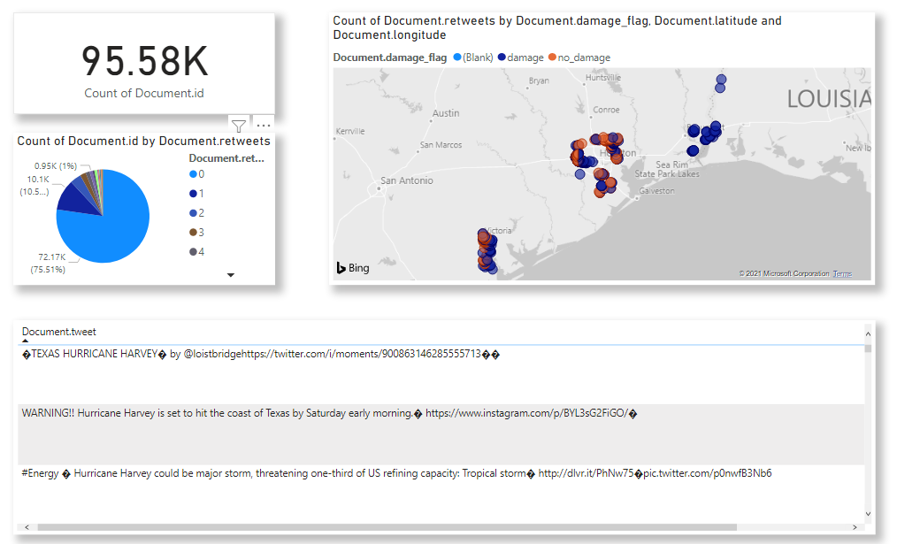

> Valid tweet data is flowing into Azure Event Hubs and then being picked up by Azure Function and writing each message to Cosmos DB. In the final testing step, I query the data from Cosmos DB with Power BI and visualize tweets with a set of simple charts.

<!--truncate-->


## Introduction

In this post, I will cover the section of the pipeline that goes from event Ingestor - Azure Event Hubs to writing messages in a No-SQL CosmosDB, and finally querying the database via Power BI Desktop  connector with a few simple charts.


##  Step 1 - Azure Event Hubs

Let us first define what is Azure Event Hub and why do we even need it?

[Event Hubs](https://docs.microsoft.com/en-us/azure/event-hubs/event-hubs-about) represents the "front door" for an event pipeline, often called an event ingestor in solution architectures. An event ingestor is a component or service that sits between event publishers and event consumers to decouple the production of an event stream from the consumption of those events. Event Hubs provides a unified streaming platform with time retention buffer, decoupling event producers from event consumers.

For more information, please check the [Microsoft Docs]([Event Hubs](https://docs.microsoft.com/en-us/azure/event-hubs/event-hubs-about)).

In the Event Hub I created, I chose two partitions with message retention of 1 day. As you can see from the service, you also have a lot of extra functionality to choose from which I decided to ignore for the time being, like using Capture events to save your events to persistent storage (that section in my pipeline is taken care of by Azure Function which writes the messages to blob storage). Then there are also options to do checkpoints and processing of data.


To define important concepts of:

- Partition count: Partitions are a data organization mechanism that relates to the downstream parallelism required in consuming applications. The number of partitions in an event hub directly relates to the number of concurrent readers you expect to have. Learn more about partitions.
- Message retention: Message Retention customization is not available in a Basic Tier Namespace. Please upgrade your Namespace to access this feature. 


Event Hubs s a fully managed Platform-as-a-Service (PaaS) with little configuration or management overhead, so you focus on your business solutions.

## Step 2 - Cosmos DB

[Cosmos DB](https://docs.microsoft.com/en-us/azure/cosmos-db/introduction) is a fully managed NoSQL database for modern app development.

Cosmos DB has several API options to choose from like key-value, wide-column, graph and document database. Since the documentation recommended that new projects that are being created from scratch should you the Core (SQL), that was obviously my choice.

The capacity mode when creating the Azure Cosmos DB account was set as Serverless (which is still in public preview).

Simple configuration is as follows:

- 1 database `hurricane`
- 1 container `tweets` partitioned by `account_id` key

Azure Cosmos DB has a nice data explorer tab that is available in the Azure portal when you create an Azure Cosmos DB account but also check out a standalone web-based interface that allows you to view and manage the data stored in Cosmos DB under a name [Azure Cosmos DB Explorer](https://docs.microsoft.com/en-us/azure/cosmos-db/data-explorer).

After sending 10000s of HTTP requests to the API endpoint, it is evident (see figure  below) after querying the tweets container via data explorer, that messages are successfully written to the database.

## Step 3 - Azure Function: Triggered by Azure Event Hub and Write to Azure Cosmos DB

In the previous step I have already tested the function I am going to describe in this section because it was a dependency needed to write the events to the database.

By its nature, it is a very simple Azure function that has a trigger to respond to an event sent to an event hub event stream, when the function is triggered, the message passed to the functions is typed as a string, and written to a binding defined as Cosmos DB, hurricane database and tweets container/collection.


Configuration as defined in `function.json`:

```
{
  "scriptFile": "__init__.py",
  "bindings": [
    {
      "type": "eventHubTrigger",
      "name": "events",
      "direction": "in",
      "eventHubName": "hurricaneevenhub",
      "connection": "hurricanetweet_managehurricanetweets_EVENTHUB",
      "cardinality": "many",
      "consumerGroup": "$Default",
      "dataType": "binary"
    },
    {
      "type": "cosmosDB",
      "direction": "out",
      "name": "outputDocument",
      "databaseName": "hurricane",
      "collectionName": "tweets",
      "createIfNotExists": "true",
      "connectionStringSetting": "hurricanecosmos_DOCUMENTDB",
      "partitionKey": "account_id"
    }
  ]
}
```

## Step 4 - Plug the data into Power BI Desktop

You can easily visualize Cosmos DB data in Power BI by using the [connector available in Power BI](https://docs.microsoft.com/en-us/azure/cosmos-db/powerbi-visualize). 

After connecting to the data and creating a few charts we can see the result on a screenshot. The figure shows the number of tweets, their locations on the map, together with the most common damage flags, and a table with the actual tweet messages.



## In the Next Post...

Prototype for the streaming part of the data pipeline is done :)

In the next post, you can expect a walk through a Python Streamlit web app, that I will host on Azure App Service.