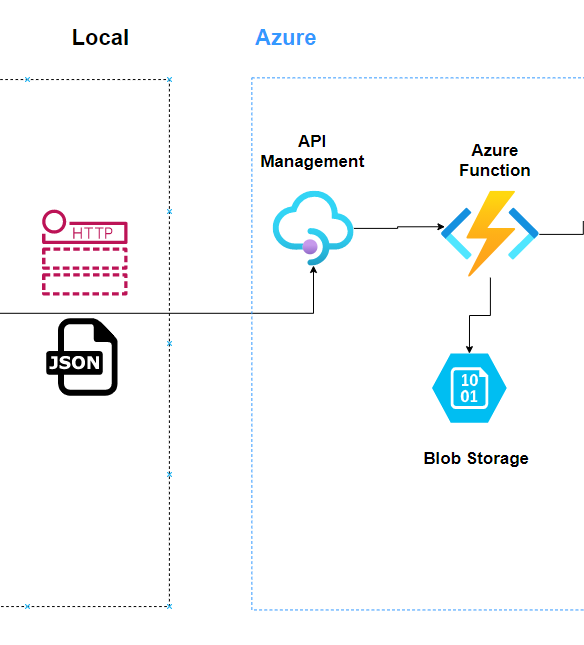
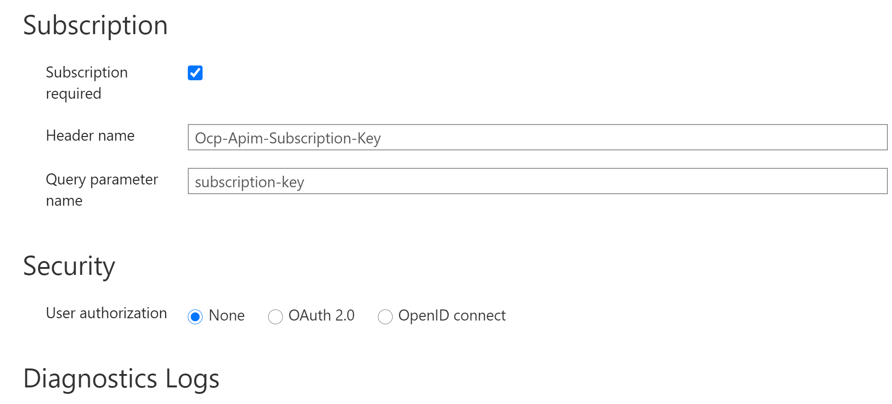
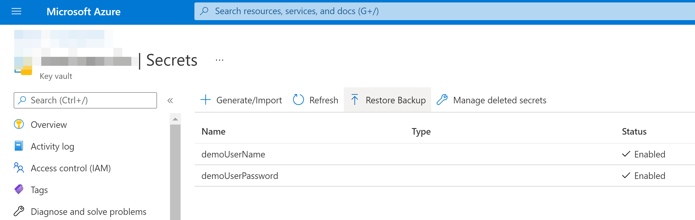
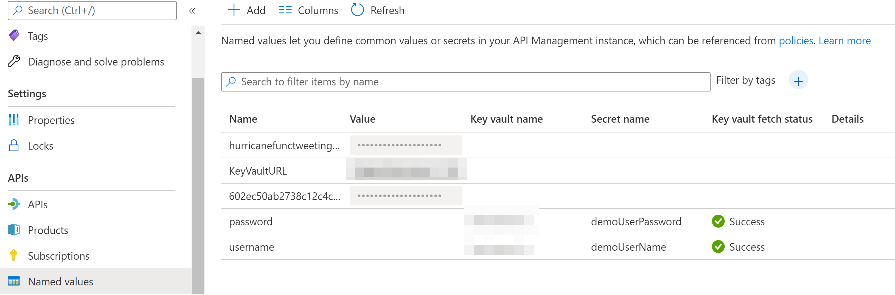

> In this post, I will create the first part of the data streaming pipeline which consists of API gateway that will accept API calls and route them to the Azure Function, which will further process the data and (initially) store them to Azure Blob Storage.

<!--truncate-->


## Introduction

Now that we have the data in the desired format and with the relevant content, we can embark in the world of Azure where we will start selecting a suite of services which will assist us in reaching our goal, and that is to build a streaming data pipeline.

As sketched on the diagramme below, in this post I will create and describe following three Azure services:


- [Azure API Management](https://docs.microsoft.com/en-us/azure/api-management/api-management-key-concepts)

- [Azure Functions](https://docs.microsoft.com/en-us/azure/azure-functions/functions-overview)

- [Azure Blob Storage](https://docs.microsoft.com/en-us/azure/storage/blobs/storage-blobs-introduction) 



Figure 1: Diagramme of the data preparation process.

# Step 1 - Azure API Management

As explained in the official Microsoft's docs, API Management (APIM) is a way to create consistent and modern API gateways for existing back-end services.

I created an API gateway that:

- had a single API endpoint which would accept API calls
- API would reference to the back-end Function App which I previously had to already create, in order for it to be accessible when I add an API in APIM
- single POST operation that represents an operation that maps to the operation mapped to the operation implemented in the backend Function App service that was written in Python.

Settings in the API were configured as following:




What is important to notice that `Subscription Required` is toggled on.
When you publish APIs through API Management, it's easy and common to secure access to those APIs by using subscription keys, which I immediately did leave as it was defaulted, with subscription required.

In order to consume the published API, I now have to include a valid subscription key in HTTP requests header when I make calls to the created API. Otherwise, the calls are rejected immediately by the API Management gateway. They aren't forwarded to the back-end services.

In addition to the to subscription key required I wanted to check out and test Policies which are a powerful capability of the Azure API Management (APIM) that allows the publisher to change the behavior of the API through configuration. APIM policy is a collection of statements executed sequentially on the request or response of an API. We can define our policy statement in four configuration sections: inbound, backend, outbound, and on-error. It is nicely explained here by [Aleksandar Stefanov in his post](https://aztoso.com/posts/apim-basic-auth-keyvault/). He also suggests to store the user details in a Key Vault secret.

As he wrote in the post, although we can think of the Basic authentication as a legacy, there are still companies who are using this authentication mechanism, mostly because of its simplicity and legacy software base. 

The following is the overview of the steps I did to enable a Basic Authentication policy together with the other necessary steps required:

1) Enabled managed identity for API management.
2) Created a Key Vault in Azure.
   
3) Enabled access to the key vault secrets from API management.
4) Added demoUserName and demoUserPassword as keys, and values as actual username and passwords.
5) Create a Named value in the API Management with the Key Vault URL, password and username
   
6) In the inbound part of your policy definition, add the following code:
        
        ```
        <policies>
            <inbound>
                <base />
                <choose>
                    <when condition="@(context.Request.Headers.     GetValueOrDefault("Authorization").AsBasic().UserId!="{     {username}}" || context.Request.Headers.GetValueOrDefault  ("Authorization").AsBasic().Password!="{{password}}")">
                        <return-response>
                            <set-status code="401" reason="Not authorized" />
                        </return-response>
                    </when>
                </choose>
                <set-header name="Authorization" exists-action="delete" />
            </inbound>
            <backend>
                <base />
            </backend>
            <outbound>
                <base />
            </outbound>
            <on-error>
                <base />
            </on-error>
        </policies>
        ```  

7) Tested with a request containing following header (it was within the Test API part of the APIM on Azure portal so Ocp-Apim-Subscription-Key: •••••••••••••••••••••••••••••••• was added automatically if toggled on): 

    `Authorization Basic <Base64 representation of the combination username:password>`

   - HTTP triggered Azure function was execured succesfully with a 200 OK status.


Now that I have a double secure way of consuming, created API, lets rewind a bit, and go to a prerequisite and that is, Azure Function that that will act as a backend and have binding s to Azure Blob Storage and Azure Events Hub.

## Step 2 - (or step 0 actually) - Azure Function(s)

Azure Function App consists of two Azure Functions as a part of an Azure streaming data pipeline

1) Azure Function in our case are acting as a backend in Azure API management, and they consume POST json tweet messages, checks validity and conformity to a predefined json schema, and if ok, it passes the data onwards to Azure Event Hub (and writes to Azure Blob Storage).

    `./HttpTriggerTweetToBlobAndEventHub`

   

I will not go into details of development environment (Locally developed on WSL2 with Ubuntu 20.04 via VisualStudio Code and its plugins for Azure Services), and code itself since it is anyway very simple.

Function will have two validation steps:

1) Check in Pyton code if invalid json was passed, if so raise an exception with an appropriate message and status code to the sender client:


2) Check if the actual json object in the body of a POST reqest is conforming to the defined json schema.
   
This is the schema that input POST request body needs to conform to:

```
tweet_schema = {
    # "$schema": "http://json-schema.org/draft-04/schema#",
    "type": "object",
    "properties": {
        "tweet_id": {
            "type": "integer"
        },
        "account_id": {
            "type": "integer"
        },
        "likes": {
            "type": "integer"
        },
        "replies": {
            "type": "integer"
        },
        "retweets": {
            "type": "integer"
        },
        "tweet": {
            "type": "string"
        },
        "time": {
            "type": "integer"
        },
        "tear_month_date": {
            "type": "string"
        },
        "damage_flag": {
            "type": "string"
        },
        "image_base64": {
            "type": "string"
        },
        "latitude": {
            "type": "number"
        },
        "longitude": {
            "type": "number"
        }
    },
    "required": [
        "tweet_id",
        "account_id",
        "likes",
        "replies",
        "retweets",
        "tweet",
        "time",
        "tear_month_date",
        "damage_flag",
        "image_base64",
        "latitude",
        "longitude"
    ]
}
```

## Step 3 - Write messages to Azure Blob Storage

If incoming json message  via HTTP POST request was accepted to created API endpoint, and if Azure Function validated the body of the tweet message sucesfully I decided to first test out the binding towards the Azure Blob Storage.

From Azure Function bindings definition:

```
   {
      "type": "blob",
      "direction": "out",
      "name": "outputBlob",
      "path": "output/{rand-guid}.json",
      "connection": "AzureWebJobsStorage"
    },
```

We see that after sucesfully sending a bunch of tweets to API endpoint and thus to azure function, all messages were sucesfully written as json files iwth a rand-guid id as filename.

  

This is the content of one example tweet opened directly in blob storage:

  


## In the Next Post...

We have a secure functioning API endpoint that accepts valid and well defined tweet messages sent as HTTP POST requests, and it is sucesfully being written to azure blob storage as json files.

In the next post, I will introduce and create following Azure Services:

  - [Azure Event Hubs](https://docs.microsoft.com/en-us/azure/event-hubs/event-hubs-about)

  - [Azure Cosmos DB](https://docs.microsoft.com/en-us/azure/cosmos-db/introduction) - SQL Core - Document Store

Main goal will be to work Azure Event Hubs as a big data streaming platform and event ingestion service which can receive and process millions of events per second, and also to store the messages into a - Azure Cosmos DB's, SQL Core - Document Store, which purpose is to act as a fully managed NoSQL database. 